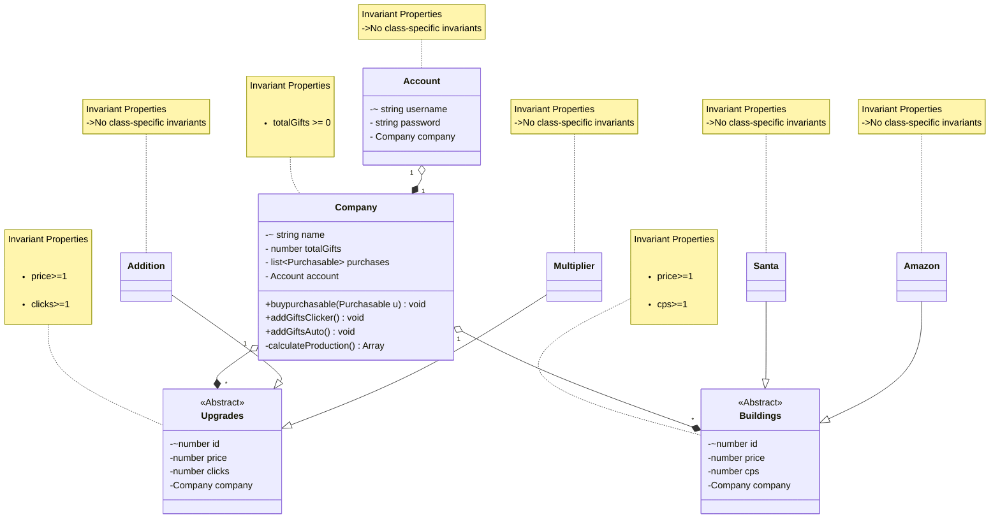

___
# Domain model for Gift Clicker
### Author: Umang Mehta
### Date: January 14, 2026
___

# Domain Model

### Modifications for Phase 2 Design: 
Modifications for Phase 2 Design:
* Renamed `Employee` and `Van` classes to `Addition` and `Multiplier`.
* Upgrades now affect both manual clicking and building production.
* Added an `Account` class to handle login and connect each user to one `Company` and `flows.md` was updated accordingly.
* Usernames are unique (natural keys), so I added a unique constraint.
* Enforced that `Company` name and `Purchasables` name must also be unique to prevent duplicate identities.
* Defined a one-to-one relationship between `Account` and `Company`, I could have merged username and password within company but that looked SRP violation to me. 
* Introduced a `Purchasable` superclass to represent both upgrades and buildings.
* Since building and upgrades had same properties they came under same hierarchy (name, price, productionValue) into Purchasable.
* Removed separate variables like gifts_per_click and cps and replaced them with a single productionValue.
* Kept `Company` as the owner of multiple Purchasable objects (one-to-many relationship).
* Updated invariants to ensure `price >= 1` and `productionValue >= 1`.

Also understood that in phase 1, they were specifically talking about `increase the power of clicking` not the number of `gifts_per_click`.

**Moving to design of this, power of clicking will be defined by following and will be done sequentially:** 
*       Additon class - which will add to power of clicking add 5 clicks
*       Multiplier class - which will multiply my power of clicking by 10 times. 
* Building would jsut be giving clicks per second and if we have bought upgrades, it would increase this power in sequence of which upgrades were added. 

### New Methods in `Company`

* `calculateProduction()` - This method calculates and return an array of number of number of clicks by upgrades and number of clicks by buildings looping over the `purchases`.
* `addGiftsClicker() void` - this method uses `calculateProduction()` to get number of gifts produced by manual clicking and adding them to `totalGifts`.
* `addGiftsAuto()void` - This method would run by `setInterval` and get uses `calculateProduction()` to get number of total gifts produced per second by buildings with upgrades.