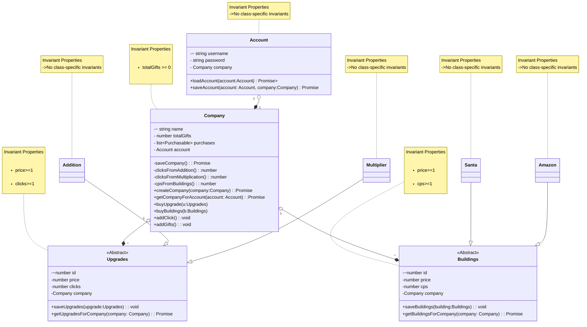

___
# Domain model for Gift Clicker
### Author: Umang Mehta
### Date: January 14, 2026
___

# Domain Model

### Modifications for Phase 2 Implementation: 
Modifications for Phase 2 Implementation:
* Added database support so Accounts, Companies, Upgrades, and Buildings can be saved and loaded 
* Gave Upgrades and Buildings an id and fixed saving so they don’t get duplicated 
* Kept Company linked to Account 1-1 Relation and made Company hold its 1 to many relationship with upgrades and buildings	
* Used Factory classes to create upgrades and buildings instead of creating them directly.
* Added an inventory system to load default upgrades and buildings	
* Implemented game logic for clicks and automatic gift generation using buildings and upgrades

### New Methods in `Company`

* `saveCompany()` - saves the current company state (gifts, upgrades, buildings) to the database
* `createCompany()` – creates a new company entry in the database
* `getCompanyForAccount()` – loads a company associated with a given account

* `addClick()` – adds gifts manually when user clicks 
* `addGifts()` – adds gifts automatically based on buildings and upgrades

* `clicksFromAddition()` – calculates extra gifts from addition upgrades 
* `clicksFromMultiplication()` – calculates multiplier effect from upgrades 
* `cpsFromBuildings()` – calculates gifts per second from buildings