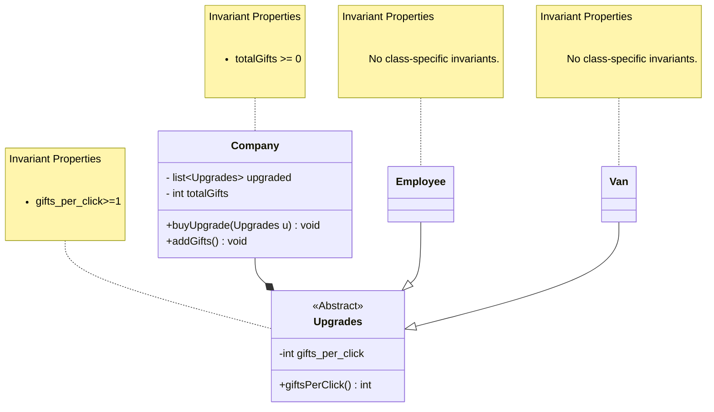

___
# Domain model for Gift Clicker
### Author: Umang Mehta
### Date: January 14, 2026
___

# Domain Model

## Methods: 
* `giftsPerClick()` :  returns the number of gifts contributed per click by this upgrade
* `buyUpgrade(Upgrades u)` : adds a purchased upgrade to the company’s upgrades list
* `addGifts()`: sums gifts per click from all upgrades and increments totalGifts.

### Modified the domain model: 
* Added a super class instead of interface 
* removed invariants where it was checking null as in TypeScript we don't need to check for the null 
* super class had properties for price/cost of upgrade and gifts delivered per click made by that upgrade
* relationships were redefined"

### Modifications for Phase 1 implementations: 
* Interface listener was added but was restriced to be added in model diagram
* addtional getters were added to the code. 