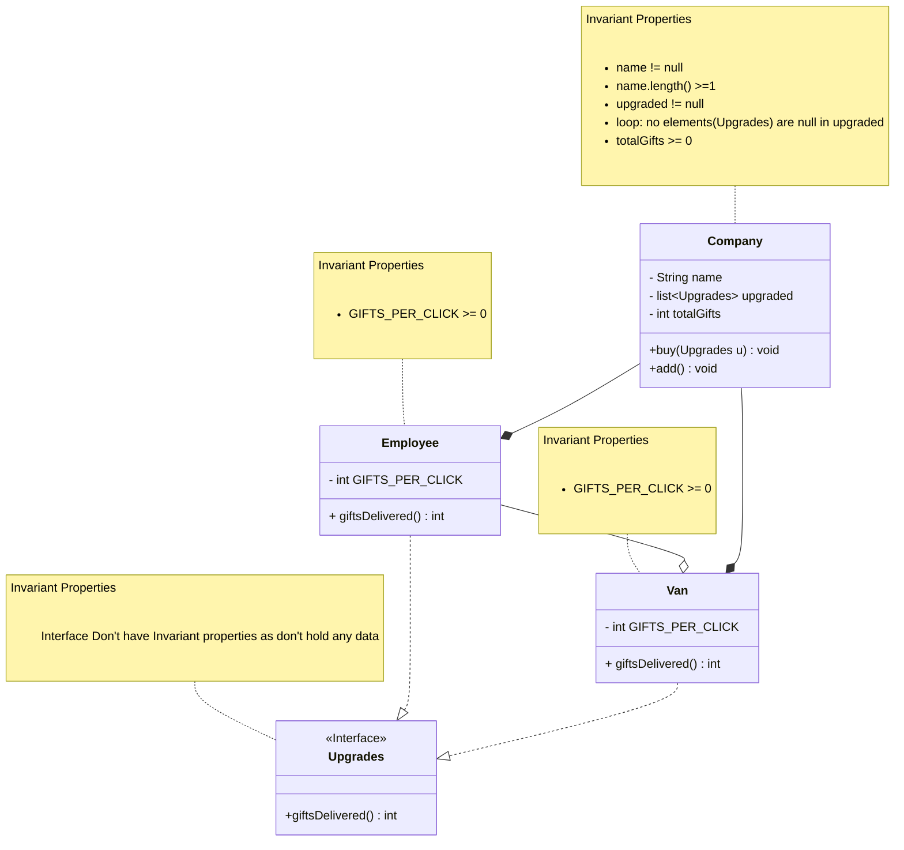

___
# Domain model for Gift Clicker
### Author: Umang Mehta
### Date: January 14, 2026
___

# Domain Model

```mermaid
classDiagram
        
        note for Company "Invariant Properties
             <ul> 
                <li> name != null
                <li> name.length() >=1
                <li>upgraded != null
                <li> loop: no elements(Upgrades) are null in upgraded
                <li> totalGifts >= 0
            </ul>
        "
    
    class Company{
        - String name
        - list~Upgrades~ upgraded
        - int totalGifts
        
        %%Purchasing the upgrade and adding it to the list
        +buy(Upgrades u) void
        
        %%this add method is responsible for calculating total gifts per click
        %%and adding them to total gifts per click.
        +add() void 
        
    }
    note for Upgrades "Invariant Properties
             <ul> 
                Interface Don't have Invariant properties as don't hold any data
            </ul>
        "
        
    class Upgrades{
        <<Interface>>
            
        %% This method would give the speciality of my upgrade
        %% Calculating the gifts/click as per the upgrade. 
        +giftsDelivered() int
    }

    note for Employee "Invariant Properties
             <ul> 
                <li> GIFTS_PER_CLICK >= 0
            </ul>
        "
    class Employee{
        - int GIFTS_PER_CLICK
        + giftsDelivered() int
    }
    
    note for Van "Invariant Properties
             <ul> 
                <li> GIFTS_PER_CLICK >= 0
            </ul>
        "
    class Van{
        - int GIFTS_PER_CLICK
        + giftsDelivered() int
    }
    
    Employee --o Van

    Company--* Employee
    Company--* Van
    
    
    Employee..|>Upgrades
    Van..|>Upgrades
```
