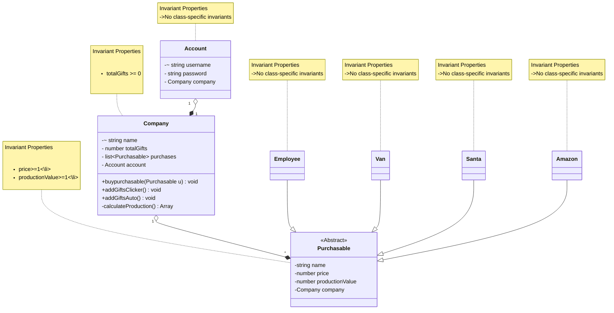

___
# Domain model for Gift Clicker
### Author: Umang Mehta
### Date: January 14, 2026
___

# Domain Model

## Methods: 
* `giftsPerClick()` :  returns the number of gifts contributed per click by this upgrade
* `buyUpgrade(Upgrades u)` : adds a purchased upgrade to the company’s upgrades list
* `addGifts()`: sums gifts per click from all upgrades and increments totalGifts.

### Modified the domain model: 
* Added a super class instead of interface 
* removed invariants where it was checking null as in TypeScript we don't need to check for the null 
* super class had properties for price/cost of upgrade and gifts delivered per click made by that upgrade
* relationships were redefined"

### Modifications for Phase 1 implementations: 
* Interface listener was added but was restricted to be added in model diagram
* additional getters were added to the code. 
* Some Styling was done using chatGPT.
* Testing was implemented and invariants were added using assertions. 

### Modifications for Phase 2 Design: 
Modifications for Phase 2 Design:
* Added an `Account` class to handle login and connect each user to one `Company`.
* Usernames are unique (natural keys), so I added a unique constraint.
* Enforced that `Company` name must also be unique to prevent duplicate company identities.
* Defined a one-to-one relationship between `Account` and `Company`, I could have merged username and password within company but that looked SRP violation to me. 
* Introduced a `Purchasable` superclass to represent both upgrades and buildings.
* Since building and upgrades had same properties they came under same hierarchy (name, price, productionValue) into Purchasable.
* Removed separate variables like gifts_per_click and clicks_per_sec and replaced them with a single productionValue.
* Kept `Company` as the owner of multiple Purchasable objects (one-to-many relationship).
* Updated invariants to ensure `price >= 1` and `productionValue >= 1`.

### New Methods in `Company`

* `calculateProduction()` - This method calcuates and return an array of number of gifts per click and number of clicks by looping over the `purchases`.
* `addGiftsClicker() void` - this method uses `calculateProduction()` to get number of gifts produced by manual clicking and adding them to `totalGifts`.
* `addGiftsAuto()void` - This method would run by `setInterval` and get uses `calculateProduction()` to get number of total gifts produced per second.