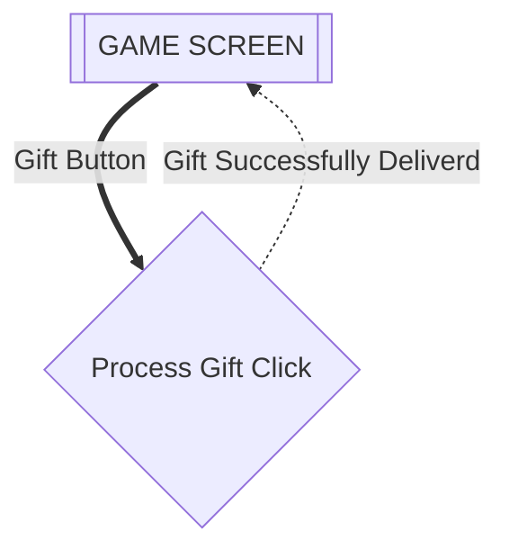
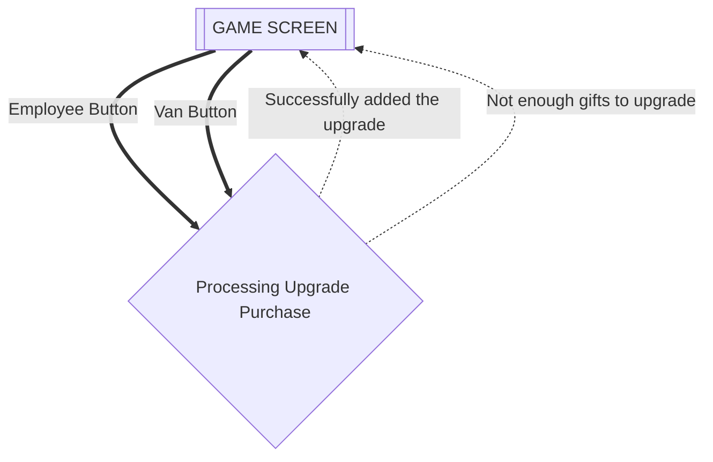

___
# Flows of Interaction for Gift Clicker
### Author: Umang Mehta
### Date: January 14, 2026
___

# Flows of interaction

## Playing game (Delivering Gifts)

This starts with your homescreen/welcome screen of the game.

## Purchasing Upgrades

While playing, you can buy upgrades.

