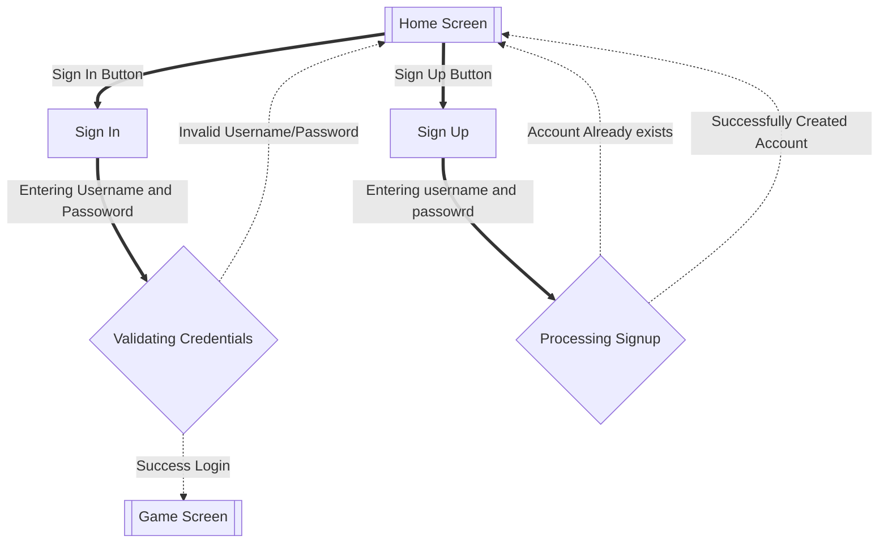
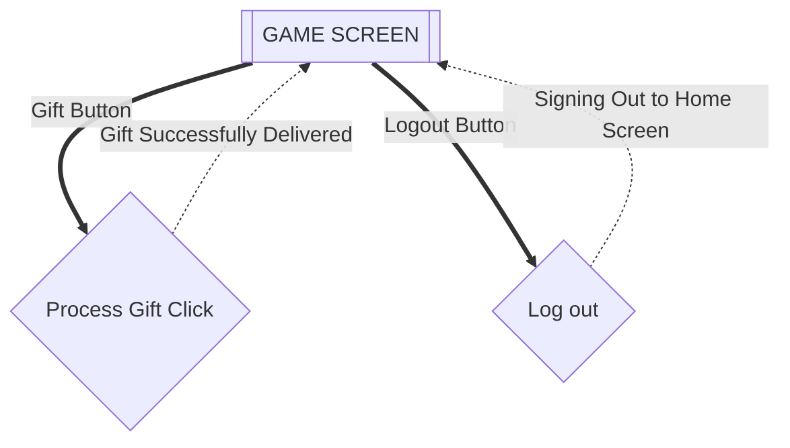
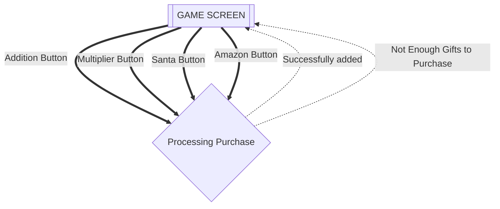

___
# Flows of Interaction for Gift Clicker
### Author: Umang Mehta
### Date: January 14, 2026
___

# Flows of interaction

# Logging in or Creating an Account

## Playing game (Delivering Gifts)
This starts with your homescreen/welcome screen of the game.

## Purchasing Upgrades or Buildings

While playing, you can purchase building and upgrades.

### Changes made for phase 1 implementation: 

* `Not enough gifts to upgrade` was successfully removed as per MVP.

### Changes made for phase 2 design:
* `Santa` and  `Amazon` were the buildings button added that now could be purchased, along with existing upgrades `Multiplier` and `Addition`.
* `Not enough gifts to Purchase` was successfully added. 

