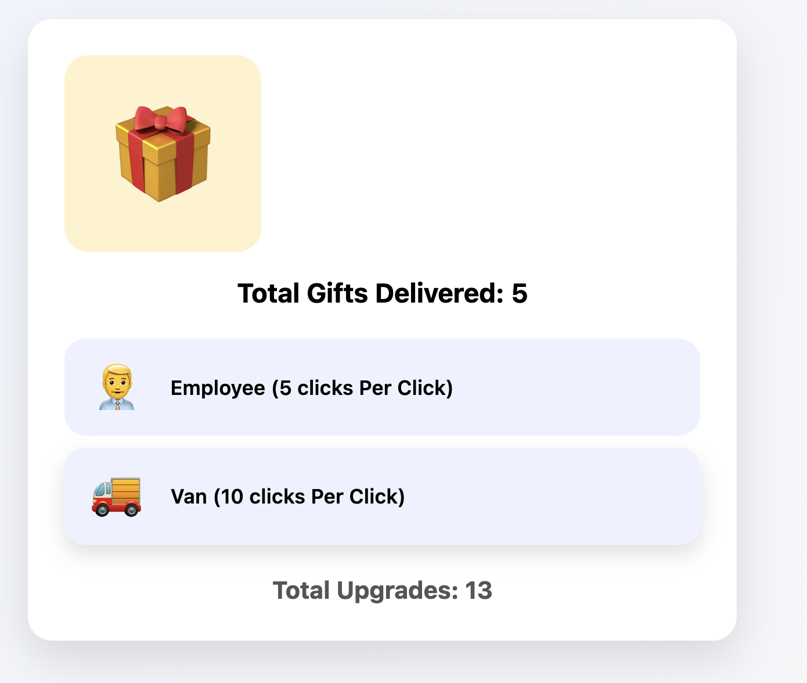
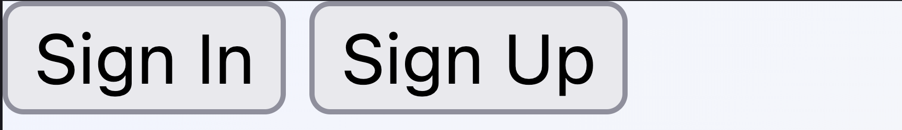
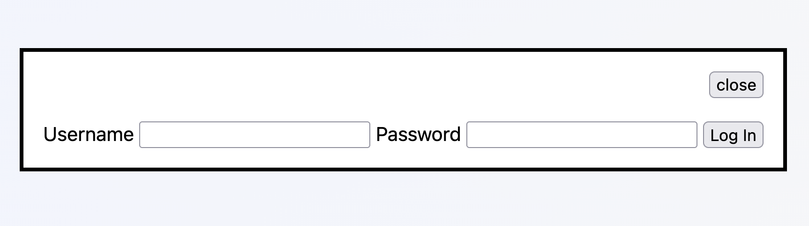
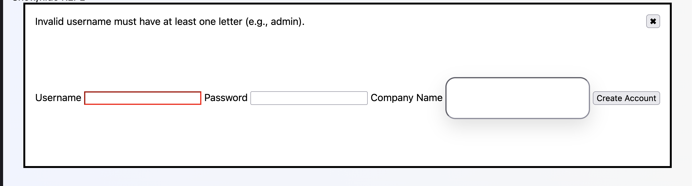
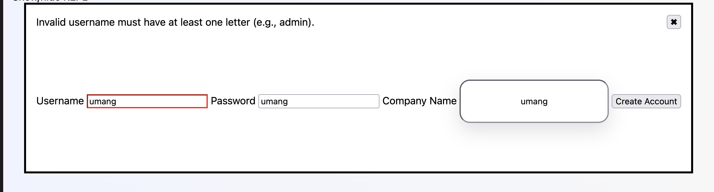
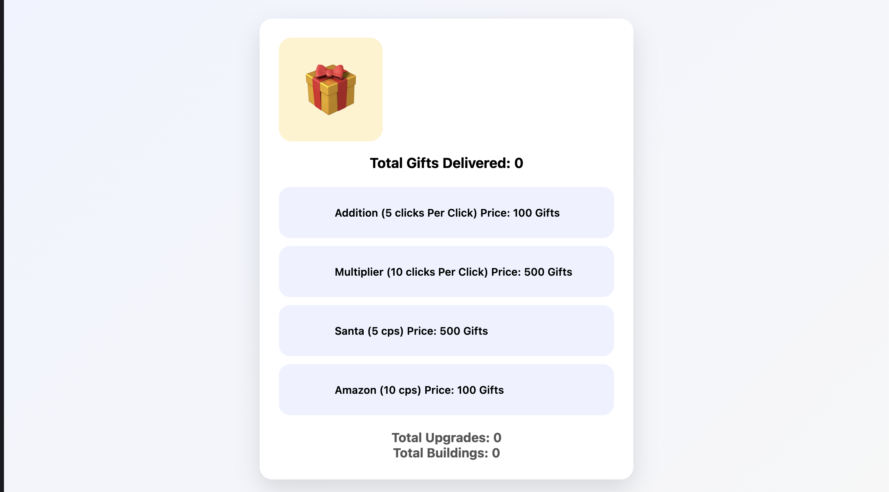
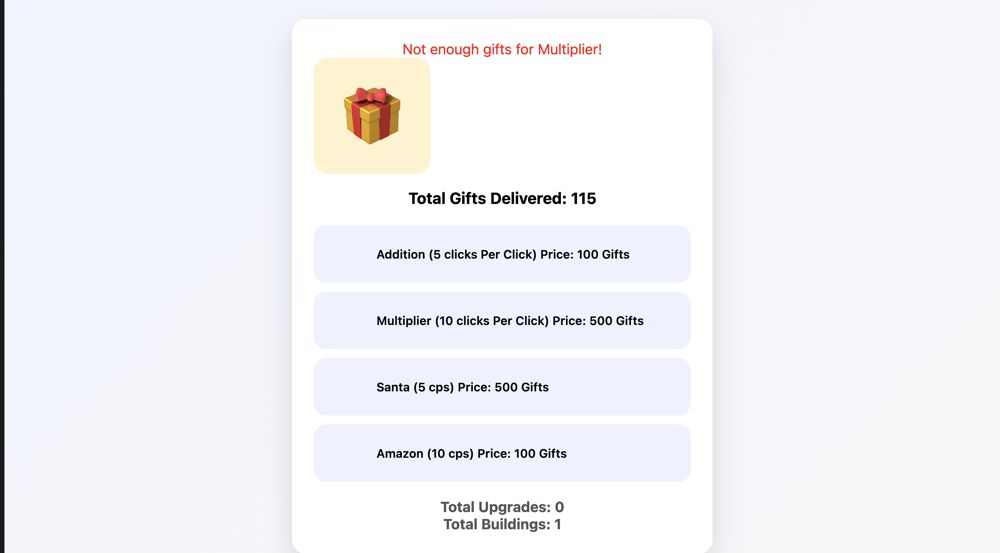

---
### Title: An assessment of my project's UI
### Author: me (mehtau@myumanitoba.ca)
Date: March 25, 2026

---

# Phase 1

## Phase-1 Visibility

My initial implementation of this UI was up to the mark, with some limitations mentioned below:

* :+1: All the buttons are clearly visible, and user doesn't need to guess what needs to be done. 
* :+1: There are features that are sometimes available and should be hidden, however it comes up in phase 2.
* :-1: Though the user mostly knows what state they are in, however this interface doesn't clearly specifies the current state of each upgrade, eg: count of each upgrades we have. 

## Phase-1 Feedback

Feedback, certainly met the expectations:
* :+1: As whenever a gift was delivered, or a button was clicked the total count went up and new results were clearly visible.
* :+1: Also when an upgrade was added the results were displayed to the user. 

## Phase-1 Consistency

Consistency was the one amongst all three which underperformed:
* :-1: Not all buttons clearly depicted the role they have, not consistent with verbs.
* :-1: A gift was just lying there without a verb and user won't know if it's a button or what it does. 
* :-1: There should be a label mentioning the upgrades section. 
* :+1: Though all the similar operations flowed in same way, like adding one upgrade or other had same technique. 

# Phase 2

Here are the major new parts of my interface for phase 2:

Here's the main UI as I submitted it for phase 2:

# Changes from phase 1

* The main change I made from phase 1 to phase 2 was to have a login setup for each game play.
* Also, two new button were added for the buildings, now upgrades could affect the buildings to reduce clicking manually.

## Phase 2 Visibility:

Overall Visibility was decent, with something's that were as per the expectation and some were missing the basic requirements.

* :+1: The homepage was perfect with clearly visible buttons for Signing up/Signing in.
* :+1: When any of each option signing/signUp was chosen, the actions were clearly visible and user knows the current state. 
* :+1: Even though some actions that were sometimes possible were not disabled, but had a proper feedback attached to it when clicked.
* :+1: After signing in, the current state of game, was with average visibility as current state with total gifts, buildings, upgrades were visible.
* :-1: However, the UI of game is displayed, the issues continued from the phase1, with lack of visibility of the current state 
which was proper displaying of number of each building or upgrades owned by user which would tell current state of each building/upgrade.
* :-1: Current state of clicks per second was also not displayed.

## Phase 2 Feedback

Feedback was done in excellent way, in most of the way except for one minute missing thing mentioned below: 

* :+1: As soon as there was duplicate username, invalid credentials, or any error state while signing up or signing in the error messages were preety clear and also mentioned the ideal output/state to be in. 
* :-1: However, when an account was successfully created it doesn't inform the user about the results the window just pops out.
* :+1: As we enter the gameplay UI, the feedback was appropriately given for any purchase that was made, or if clicks were being made manually.
* :+1: Every result of action taken was being properly displayed under total gifts, buildings, upgrades.

## Phase 2 Consistency

Consistency was the one that needed a lot of work:

* :+1: All the Sig in/Sign up buttons were consistent and properly labeled with same verbs to describe the action.
* :+1: All similar operation like adding building/upgrade had same flow which minimized the learning. 
* :-1: A clear violation of having same labels. When a user clicks sign in/ sign up, there were different labels for closing the window that was opened. 
* :-1: Continuing from phase 1, the issue was the clear labels were not mentioned for Upgrades/Buildings, which should be like a separate section for these two, making it clear to the user which ones are upgrades and which were buildings.
* :-1: The buttons didn't have clear verbs of what they would do: It should have been something like purchase santa, Purchase Addition.

Overall, while the interface improved in feedback and structure, issues in visibility of system state and consistency in labeling still impacted usability.

## How I might change my UI

* I would add proper labels for upgrades and buildings by separating them into clear sections so user can easily understand what each item belongs to.
* Add clear action verbs like “Purchase/Buy” for all buttons so that user does not have to guess what each element does. 
* Display more of the current state such as clicks per second and number of each building and upgrade owned.
* Improve feedback by showing a confirmation message when important actions like account creation are completed.
